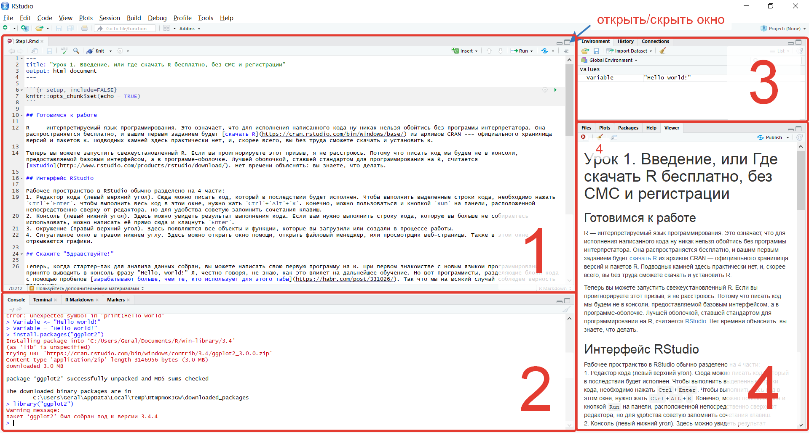

```{r, echo=FALSE}
htmltools::img(src = knitr::image_uri(file.path("ciom_logo.png")), 
               alt = 'logo', 
               style = 'position:absolute; top:0; right:0; padding:10px; width:20%')
```

---
```{r setup, include=FALSE}
knitr::opts_chunk$set(echo = TRUE)
```

## Готовимся к работе

R --- интерпретируемый язык программирования. Это означает, что для исполнения написанного кода ну никак нельзя обойтись без программы-интерпретатора. Она распространяется бесплатно, и вашим первым заданием будет [скачать R](https://cran.rstudio.com/bin/windows/base/) из архивов CRAN --- официального хранилища версий и пакетов R. Подводных камней здесь практически нет, и, скорее всего, вы без труда сможете скачать и установить R.  

Теперь вы можете запустить свежеустановленный R. Если вы проигнорируете этот призыв, я не расстроюсь. Потому что писать код мы будем не в консоли, предоставляемой базовым интерфейсом, а в программе-оболочке. Лучшей оболочкой, ставшей стандартом для программирования на R, считается [RStudio](http://www.rstudio.com/products/rstudio/download/). Нет времени объяснять: вы знаете, что делать.

## Интерфейс RStudio



<br/>
Рабочее пространство в RStudio обычно разделено на 4 части:  
**1. Редактор кода** (левый верхний угол). Сюда можно писать код, который в последствии будет исполнен. Чтобы выполнить выделенные строки кода, необходимо нажать `Ctrl`+`Enter`. Чтобы выполнить весь код в этом окне, нужно жать `Ctrl`+`Alt`+`R`. Конечно, можно пользоваться и кнопкой `Run` на панели, расположенной непосредственно сверху от редактора, но для удобства советую запомнить сочетания клавиш.  
**2. Консоль** (левый нижний угол). Здесь можно увидеть результат выполнения кода. Если вам нужно выполнить строку кода, которую вы больше не собираетесь использовать, можно написать её прямо сюда и клацнуть `Enter`.  
**3. Окружение** (правый верхний угол). Здесь появляются все объекты и функции, которые вы загрузили или создали в процессе работы.  
**4. Ситуативное окно** в правом нижнем углу. Здесь можно открыть окно помощи, открыть файловый менеджер, или просмотрщик веб-страницы. Также в этом окне отркываются графики.  

## Скажите "Здравствуйте!"

Теперь, когда стартер-пак для анализа данных собран, вы можете написать свою первую программу на R. При первом знакомстве с новым языком программирования принято выводить в консоль фразу "Hello, world!" Я, честно говоря, не знаю, как это влияет на дальнейшее обучение. Но вот программисты, разделяющие блоки кода с помощью пробелов [зарабатывают больше, чем те, кто использует для этого табы](https://habr.com/post/331026/). Так что мы на всякий случай соблюдем верность традициям.

Вам нужно написать в консоли функцию `print()` с аргументом "Hello world!". Эта функция, в соотвтествии с названием, печатает аргумент в консоль. Ставить кавычки в этом случае обязательно, так как именно они указывают на то, что фраза Hello world! --- строка. 

После того, как вы напишете выражение в редакторе кода и клацнете `Ctrl`+`Enter` (выполняет код на строке, в которой находится курсор), у вас должно получиться примерно так:
```{r }
print("Hello, world!")
```

Сейчас, как я уже говорил, мы использовали строку, напрямую передав её функции в качестве аргумента. Но обычно при работе в R функциям передают переменные. Давайте просто попробуем создать нашу первую переменную и присвоить ей значение "Hello world!".
```{r }
Variable <- "Hello world!"
print(Variable)
```

Как вы видите, переменная Variable теперь означает "Hello world!" Также она должна появиться в окне Environment в правом верхнем углу. Там, как уже говорилось, вы всегда сможете увидеть все объекты, созданные в ходе текущей сессии. Оператор присваивания, как вы могли заметить, выглядит так `<-`. Можно, конечно, использовать вместо него `=`, но у него есть некоторые ограничения. Cуществуют горячие клавиши, печатающие оператор присваивания: `Alt`+`-`. Их стоит запомнить.

Теперь вы можете сохранить на память свою первую программу в R, воспользовавшись графическим интерфейсом оболочки (`File`>`Save As`).

## Олег, где пакет?

Напоследок, мы должны решить еще один технический вопрос. Порой стандартный синтаксис R может выглядеть громоздко и беспомощно перед мощью дополнительных пакетов, поэтому мы никак не можем пройти мимо них. Они устанавливаются командой `install.packages()`, где аргументом является название требуемого пакета в кавычках. Давайте попробуем установить пакет *ggplot2*, являющийся стандартом графической визуализации данных в R.

```{r eval=FALSE}
install.packages("ggplot2")
```

В консоли что-то забурлит и через некоторое время выдаст нам `package ‘ggplot2’ successfully unpacked and MD5 sums checked`. Если же этого не произошло или вы видите какие-то `Error`, попробуйте закрыть R и запустить от имени администратора (Правая кнопка мыши > Запуск от имени администратора). Если это тоже не помогло, пишите в диалог и мы разберемся, что же случилось.

Пакет ggplot2 установлен, и теперь его нужно покдлючить. Делается это функций `library()`, аргументом снова является название пакета в кавычках.

```{r eval=FALSE}
library("ggplot2")
```

Теперь пакет подключен. Однако, если вы выйдете из RStudio, а затем войдете снова, то пакет будет отключен и его снова придется подключать. Поэтому принято прописывать все подключения пакетов в верхней части кода. Так, при выпонении его целиком сначала будут подключаться пакеты, а потом уже использоваться предоставляемые ими функции, и не будет никаких ошибок.

## Небо в алмазах

И напоследок я попрошу вас выполнить простое задание и отправить ответ на него в [Google-форму](https://docs.google.com/forms/d/e/1FAIpQLScmuQBs1hcmJXGH4F92D4Ka5j1HoMMckSXhVObsn7VKMt71NQ/viewform?usp=sf_link). Найдите среднюю стоимость камней в датасете `diamonds` (подробнее о нем --- `help(diamonds)`). В R встроено приличное количество датасетов, на которые вы можете посмотреть, выполнив команду `data()`. При необходимости к некоторым из них мы будем обращаться.
Итак, чтобы выполнить задание, нужно найти датасет. Он витает прямо в воздухе, и чтобы посмотреть на него, достаточно набрать `diamonds` и выполнить код (или написать в консоль в нижнем окошке и нажать `Enter`). Теперь нужно обратиться к столбцу `price`. Для этого нам нужен доллар: `diamonds$price`. Если выполнить этот код, то вы увидите в консоли список цифр: оно и нужно. Наконец, чтобы найти среднее, этот список нужно передать в функцию `mean()`. Дальше сами, и не забудьте добавить ответ в форму :)

## Пользуйтесь дополнительными материалами

[Stack Overflow](https://stackoverflow.com) --- незаменимая вещь. Здесь вы сможете найти ответ практически на любой вопрос, касающийся R.  
[Google](https://www.google.ru/) --- поможет вам найти нужную ссылку на Stack Overflow, поправив, если это нужно, ваш английский.  
Официальные [шпаргалки по R](https://www.rstudio.com/resources/cheatsheets/) --- pdf'ы формата А4, которые удобно печатать и вешать на стену или просто открывать на компьютере, когда что-то забыли. Там есть шпаргалки как по базовому синтаксису, так и по пакетам R.  
[Медико-биологическая статистика Гланца](http://medstatistic.ru/articles/glantz.pdf) --- хороший учебник для изучения статистики, написанный понятным языком. В общем, он соответствует названию и действительно подходит для медиков.  
[Stepik](https://stepik.org) --- здесь вы сможете найти целых 3 полноценных курса по R, раскрывающих его разные стороны. Там есть заставляющие попотеть задания и автоматическая проверка кода. Если понравится --- you're welcome!  
<br/>
<br/>
*Если что-то осталось непонятным, не стесняйтесь задавать вопросы в диалоге. Мы ведь для этого и собрались.*